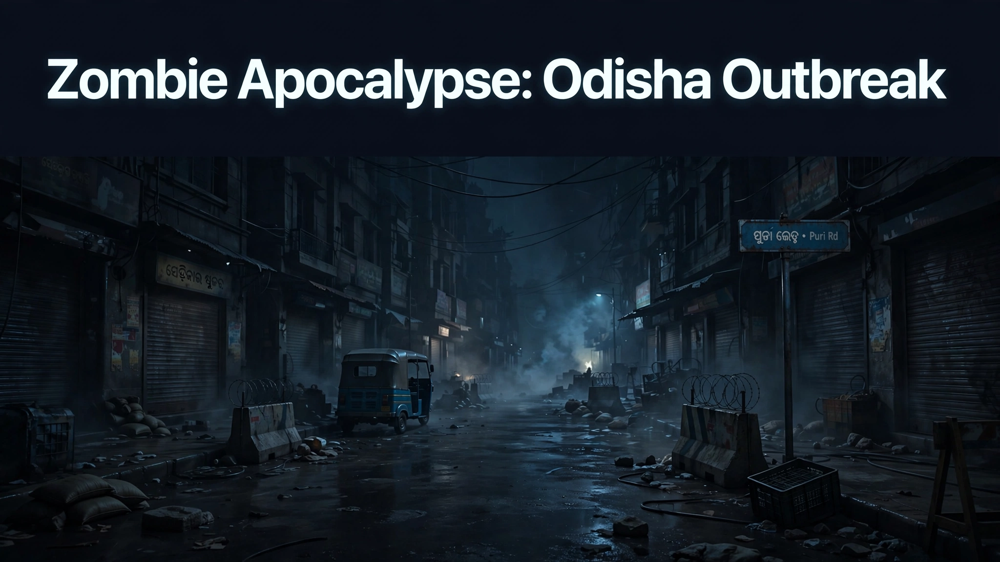

# Zombie Apocalypse — Odisha Outbreak

> ## Status: 🟢 Completed
>
> <progress value="95" max="100"></progress>
> **Progress: 95%** — Full story loop wired end to end and reviewed APPROVED; headless harness confirms WIN is reachable on the real player path.

<p align="center">
  
</p>


> Repository: `Geltrax69/Games` · Default branch here: `feat/zombie-apocalypse-3js-game`

## What it is

A browser-based, first-person 3D zombie-survival game built with **three.js** (r160, vendored locally — no CDN, no npm, no build step). You wake up in your room in Odisha, India, during a zombie outbreak, fight through the infested streets with a knife and a scavenged pistol, help the last survivors build a cure, and board a helicopter to spread it. It runs **entirely offline** as a static site: every mesh, texture, and sound is generated procedurally in code (canvas textures + Web Audio synthesis). A `QuestManager` drives the fixed objective chain — wake → survive → find gun → meet survivors → research → collect ingredients → travel north → deliver → board helicopter → WIN — with player death ending in a **YOU DIED** screen. Every NPC is killable (friendly, scientist, hostile "raiders"); killing a quest-critical NPC is allowed but surfaced with a warning, and a lab terminal fallback means the game can never soft-lock. This is a **single-player** vertical slice, not the MMORPG from the original concept.

## What works (verified)

Verified by reading all game modules (`js/core/`, `js/entities/`, `js/world/`, `js/quest/`, `js/ui/`) — every file passes `node --check`, and the project's two code reviews (`.agents/tasks/`) confirm the harness drives the full path to WIN.

- ✅ Opening objective transition fixed in code — crossing the room doorway fires `left_room`, advancing `OBJ_WAKE → OBJ_SURVIVE`; a first `zombie_killed` while still in the room also advances it (verified present in `js/quest/QuestManager.js`).
- ✅ Full 10-objective story loop wired — `OBJ_WAKE → OBJ_SURVIVE → OBJ_FIND_GUN → OBJ_MEET_SURVIVORS → OBJ_RESEARCH → OBJ_COLLECT → OBJ_TRAVEL → OBJ_DELIVER → OBJ_FINALE → WIN`, each advanced by real game events.
- ✅ Two zones with travel — Odisha City (room → city, research center, ingredients) and the Medical Facility (delivery + helicopter finale); ingredient-gated north exit between them.
- ✅ Combat system — knife melee cone hit test, pistol hitscan raycast, ammo, reload, muzzle/swing feedback; zombie AI (idle / wander / chase / attack / die) with separation and death cleanup.
- ✅ NPC systems — friendly, scientist, and hostile NPCs with dialogue and quest hooks; all killable with no soft-lock (self-serve lab terminal fallback if the scientist dies).
- ✅ HUD & overlays — health, weapon, ammo, objective, zone, toasts; start / pause / win / lose screens with story intro and controls legend.
- ✅ Procedural audio — gunshot, knife swing, zombie growl, hits, player damage, pickups, objective-complete, death, and victory, all synthesized via Web Audio.
- ✅ Fully offline — three.js r160 committed under `vendor/three/` and loaded via an import map in `index.html`; no image/model/audio files to fetch; no TODO/FIXME markers found in `js/` or `index.html`.
- ✅ Headless verification harness — `window.__GAME__.debugState()`, `window.__consoleErrors`, and `window.__GAME__.test` hooks expose the game for automated verification.

Not run here: the game needs a desktop browser with pointer-lock to actually play; no headless run was performed in this audit.

## Tech stack

| Layer | Choice |
|---|---|
| 3D | three.js r160 (vendored under `vendor/three/`, import map) |
| Language | Vanilla JavaScript ES modules |
| Textures | Runtime `<canvas>` → `CanvasTexture` (procedural) |
| Audio | Web Audio API (oscillators + filtered noise, synthesized live) |
| Style | `css/style.css` (HUD, overlays) |
| Server | Any static file server (must be served over HTTP — not `file://`) |

## How to run

This is a static site using **ES module import maps**, so it **must be served over HTTP** — opening `index.html` via `file://` will not work (the browser blocks module/import-map resolution).

From the repository root:

```bash
python3 -m http.server 8000
```

Then open **http://localhost:8000** in a modern desktop browser (Chrome, Edge, or Firefox). Click **START**, then click the game window once to lock the mouse for look controls. Any static file server works (`npx serve`, nginx, etc.).

### Controls

| Input | Action |
|---|---|
| **W A S D** | Move |
| **Shift** | Run |
| **Mouse** | Look around |
| **Click / Left-click** | Fire the gun or swing the knife |
| **1 / 2** | Switch weapon (1 = knife, 2 = pistol) |
| **R** | Reload the gun |
| **E** | Interact (talk to survivors, enter the research center, deliver ingredients, board the helicopter) |
| **Space** | Jump |
| **Esc** | Pause / resume |

Pickups (gun, ammo, medkit, cure ingredients) are grabbed automatically when you walk over them.

## Screenshots

No screenshots are committed in the repo. The banner above is the visual; all game art is generated procedurally at runtime.

## What you can add more

- [ ] More zones — the `Zone` subclass system is built for it (`js/world/zones/`); the slice ships only Odisha City + Medical Facility.
- [ ] Save/load — there is no persistence, multiplayer, or accounts by design of the static-site constraint.
- [ ] Touch/mobile controls — desktop mouse + keyboard only today.
- [ ] Advanced pathfinding for zombies — current AI is idle / wander / chase / attack.
- [ ] Swap procedural assets for real models/textures — everything goes through `AssetFactory`, so bodies can be replaced with `GLTFLoader` calls without touching game logic.
- [ ] Record a real playthrough video — the review claims hold in code, but no captured run is in the repo.

## Project structure

```
index.html        Entry page, import map, HUD/overlay markup
css/style.css     HUD and overlay styling
js/
  main.js           Bootstraps the game, error filter, test harness hooks
  core/             Game.js (loop, state machine), Input, AudioManager
  entities/         Player, Weapon (knife→pistol), Zombie, NPC
  quest/            QuestManager (ordered objectives, event-driven)
  world/            Zone base class + zones/ (OdishaCity, MedicalFacility)
  assets/           AssetFactory (all procedural meshes/textures)
  ui/               HUD (health, ammo, objective, toasts)
vendor/three/      three.js r160 (builds + PointerLockControls + LICENSE)
```

To add a location: subclass `Zone` in `js/world/zones/`, register it in `Game._buildZones()` in `js/core/Game.js`, and point an existing zone's exit at it.

## Credits and license

- **three.js** (r160) — MIT License; full license text vendored at `vendor/three/LICENSE`. Copyright (c) 2010–present three.js authors. See <https://threejs.org>.
- All other code and procedurally generated assets were created for this project.

---
*README written after code audit on 2026-10-08.*
