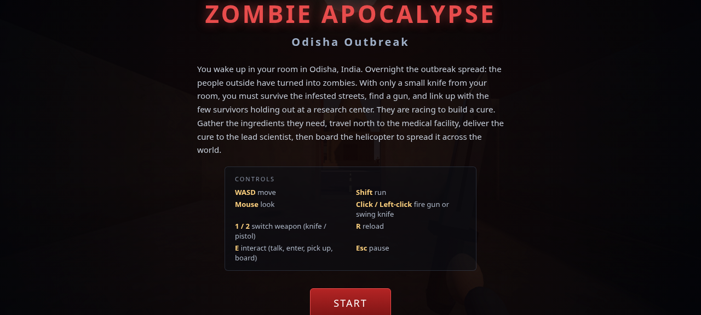
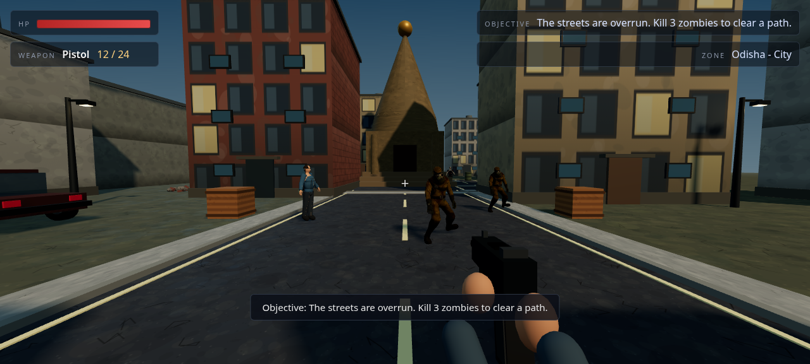
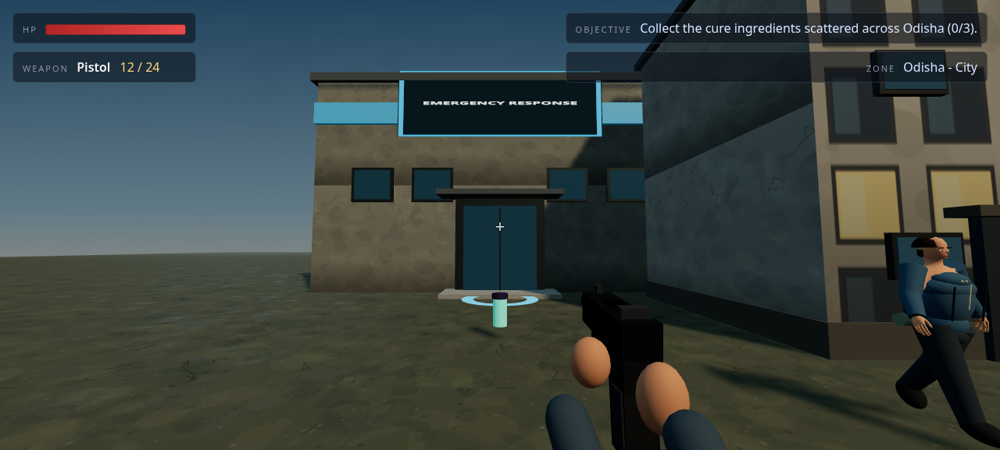
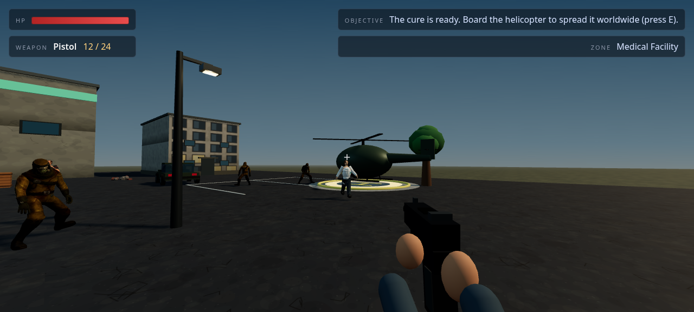
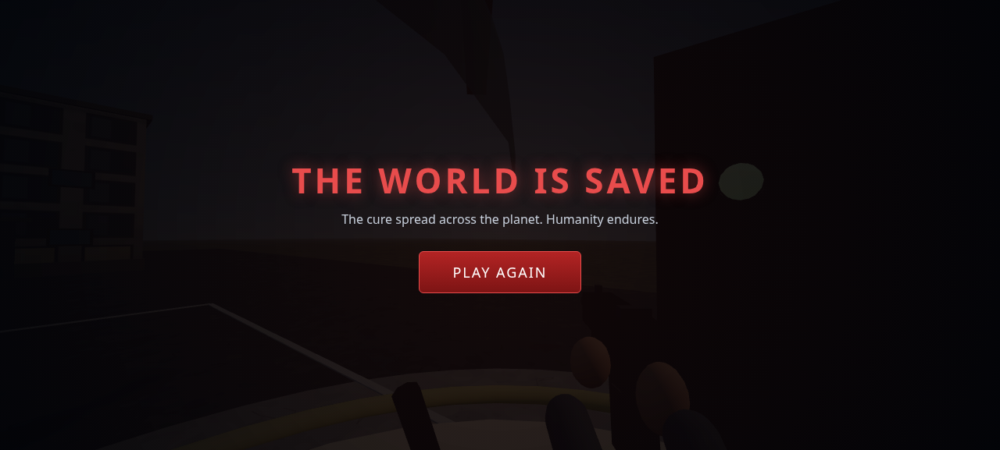

# Zombie Apocalypse - Odisha Outbreak

A browser-based, first-person 3D zombie-survival game built with **three.js**. You
wake up in your room in Odisha, India, during a zombie outbreak, fight your way
through the infested streets with a knife and a scavenged pistol, help the last
survivors build a cure, and finally board a helicopter to spread that cure across
the world.

It runs **entirely offline at runtime** as a static site: no build step, no
bundler, no npm, and no CDN or remote asset requests. Creative Commons-licensed
character GLBs (CC BY and CC0) and their three.js loaders are vendored locally; the terrain/facade PBR-style
textures and all sound effects are generated procedurally in the browser.

## Gameplay preview

These screenshots were captured from the actual playable three.js build.



| Fighting zombies in Odisha City | Finding cure ingredients at the research center |
| :---: | :---: |
|  |  |

| Boarding the cure helicopter | Completing the campaign |
| :---: | :---: |
|  |  |

---

## 1. How to run

This is a static site that uses **ES module import maps**, so it **must be served
over HTTP** - opening `index.html` directly via `file://` will not work (the
browser blocks module/import-map resolution and local module loads).

From the repository root:

```bash
cd Games
python3 -m http.server 8000
```

Then open **http://localhost:8000** in a modern desktop browser (Chrome, Edge, or
Firefox). Click **START**, then click the game window once to lock the mouse for
look controls.

Any static file server works (`python3 -m http.server`, `npx serve`, nginx, etc.);
Python's built-in server is used above because it needs no installation.

---

## 2. Controls

| Input | Action |
| --- | --- |
| **W A S D** | Move |
| **Shift** | Run |
| **Mouse** | Look around |
| **Click / Left-click** | Fire the gun or swing the knife |
| **1 / 2** | Switch weapon (1 = knife, 2 = pistol) |
| **R** | Reload the gun |
| **E** | Interact (talk to survivors, enter the research center, deliver ingredients, board the helicopter) |
| **Space** | Jump |
| **Esc** | Pause / resume (releases and re-locks the mouse) |

Pickups (gun, ammo, medkit, cure ingredients) are grabbed automatically when you
walk over them.

---

## 3. Story and objective flow

You play a survivor who wakes up in a locked room in **Odisha** as the outbreak
turns the people outside into zombies. Armed at first with only a small knife, you
must survive, find better weapons, and help the remaining survivors complete and
distribute a cure.

The objective flow (shown live in the HUD) runs end to end:

1. **OBJ_WAKE** - You wake in your room. Walk out through the doorway into the
   city; stepping through the doorway completes this objective (killing your
   first zombie also clears it if you fight in the doorway).
2. **OBJ_SURVIVE** - The streets are overrun. Kill a few zombies to clear a path.
3. **OBJ_FIND_GUN** - A knife is not enough. Find the pistol dropped in the city.
4. **OBJ_MEET_SURVIVORS** - Find other survivors and talk to one (press E).
5. **OBJ_RESEARCH** - A survivor points you to a research center. Enter it (press E)
   to receive the cure task; the needed ingredients are marked around the city.
6. **OBJ_COLLECT** - Collect the cure ingredients scattered across Odisha.
7. **OBJ_TRAVEL** - With the ingredients gathered, travel north to the Medical
   Facility (walk into the north-road exit trigger).
8. **OBJ_DELIVER** - Deliver the ingredients to the lead scientist (press E). If the
   scientist has been killed, a self-serve lab terminal accepts the delivery so the
   game can never soft-lock.
9. **OBJ_FINALE** - The cure is ready. Board the helicopter (press E).
10. **WIN** - The cure is spread across the world. Humanity endures.

There are also **hostile NPCs** ("cultists"/"raiders") who want the apocalypse to
continue - they attack on sight. **Every NPC is killable**, including friendly
survivors and the scientist; killing a quest-critical NPC is allowed but surfaced
with a warning, and the story can still be completed through the fallback terminal.

Player death (health reaches 0) ends the run with a **YOU DIED** screen and a
restart button.

---

## 4. What was built vs deferred

**Built (the playable vertical slice):**

- First-person controller (WASD + mouse look via `PointerLockControls`, run, jump,
  gravity, circular collision) with health and a damage vignette.
- Weapon system with a **knife -> pistol** progression: melee cone hit test and gun
  hitscan (raycast), ammo, reload, muzzle/swing feedback.
- Zombie AI (idle / wander / chase / attack / die) driving a textured, animated
  hazmat-zombie model, with varied phase/scale/tint, contact damage, separation,
  procedural fallback, and death cleanup.
- Friendly, scientist, and hostile NPCs using a CC0 anatomical human armature with
  varied skin/hair/face treatment, layered modern role clothing, and manually driven
  idle/walk/attack bone animation; all remain killable.
- Richer generated environments: soil/asphalt/concrete PBR-style surfaces, marked
  roads and sidewalks, a medical compound/helipad, detailed facade/roof materials,
  and recognizable cars, streetlights, trees, rubble, props, and helicopter.
- Two modular zones: **Odisha City** (room -> city, research center, ingredients)
  and the **Medical Facility** (delivery + helicopter finale), with zone travel.
- A `QuestManager` driving the full ordered objective flow above.
- Live HUD (health, weapon, ammo, objective, zone, toasts), start / pause / win /
  lose overlays with a story intro and controls legend.
- Procedural audio (Web Audio API) for gunshot, knife swing, zombie growl, hits,
  player damage, pickups, objective-complete, death, and victory.
- A headless verification harness (`window.__GAME__.debugState()`,
  `window.__consoleErrors`, and `window.__GAME__.test` hooks).

**Deferred / out of scope for this slice:**

- A true open world spanning the whole planet or many countries (see the scope
  note below) - the slice ships one city plus one travel destination.
- Additional character, prop, weapon, and audio libraries beyond the two bundled
  character assets and generated environment/audio systems shipped here.
- Networking / multiplayer / accounts / persistence / save games.
- Deep RPG systems (leveling, inventory management beyond weapons/ammo/medkits,
  crafting, skill trees), advanced pathfinding, and mobile/touch controls.

---

## 5. Offline assets and local preload

The game performs **zero external-origin runtime requests**. Everything needed by
the static site is committed in the repository and served from the same origin:

- **Characters are bundled local glTF assets.** The animated
  [`zombie-hazmat.glb`](assets/models/zombie-hazmat.glb) and rigged CC0
  [`male-base-mesh.glb`](assets/models/male-base-mesh.glb) files preload before
  `Game` construction. The human base has no embedded clips; the runtime drives
  additive idle, walk, and attack poses directly through its armature and layers
  role clothing and face/hair details onto each uniquely owned instance.
  `GLTFLoader`, `SkeletonUtils`, and the Meshopt decoder are vendored at the
  matching three.js r160 revision. If either GLB cannot load, a synchronous
  procedural humanoid fallback keeps the game playable instead of leaving a
  blank screen. `debugState().visualAssetDetails.human` exposes both the load
  status and `male-base-mesh.glb` source name for browser verification.
- **Environment surfaces remain procedural.** Soil, asphalt, concrete, walls,
  facades, bump maps, and roughness maps are drawn deterministically onto canvas
  textures in `js/assets/AssetFactory.js`. Sound effects are synthesized with the
  **Web Audio API** in `js/core/AudioManager.js`.
- **three.js is vendored locally.** three.js **r160** and all required support
  modules live under [`vendor/three/`](vendor/three/) and resolve through the
  import map in `index.html`. Nothing is pulled from a CDN.

The model creators, source links, licenses, and runtime treatment are documented
in [`assets/models/CREDITS.md`](assets/models/CREDITS.md).

---

## 6. Scope note: single-player, not a true MMORPG

The original concept described an MMORPG spanning the entire planet. This
deliverable is a **single-player** game, not a massively-multiplayer online RPG.
Servers, accounts, matchmaking, and simultaneous players are out of scope for a
static, offline, client-only site: there is no backend to host shared world state
or authenticate players.

Similarly, rather than modeling the whole world, the slice ships **one starting
city (Odisha)** plus **one travel destination (the Medical Facility)**. That is
enough to demonstrate the full story loop - wake up, survive, arm up, gather the
cure, travel, deliver, and fly out to spread it - while staying performant in a
browser. The zone system (below) is built so more locations can be added later.

---

## 7. How to extend

The code is organized so the world and the assets can grow without rewriting game
logic.

**Add a new location (Zone):**

1. Create a subclass of `Zone` under `js/world/zones/`, e.g.
   `js/world/zones/DelhiStreets.js`, and implement `build()` to populate the zone
   (call `this.group.add(...)`, `this.addCollider(...)`, `this.addNPC(...)`,
   `this.addPickup(...)`, `this.addInteractable(...)`, and `this.addExit(...)`, and
   set `this.spawns` for zombie spawn points and `this.entryPoints` for where the
   player arrives). See `js/world/zones/OdishaCity.js` and
   `js/world/zones/MedicalFacility.js` for working examples.
2. Register it in `Game._buildZones()` in `js/core/Game.js` (add it to the `zones`
   map), and point an existing zone's `addExit({ target: 'YourZoneId', ... })` at it
   so the player can travel there. If it should advance the quest, wire its callbacks
   into `this.quest.handleEvent(...)` the same way the existing zones do.

**Swap or add visual assets:**

Character models are preloaded once by `js/assets/ModelLibrary.js`, then cloned
synchronously behind the `AssetFactory` API (`makeZombie`, `makeNPC`,
`makePlayerViewmodel`, etc.). To replace a bundled character, update the local
manifest and preserve each factory's returned object shape: ground-pivot groups,
local +Z forward, `userData.parts` for zombies, `userData.kind` for NPCs, the
identity viewmodel wrapper, and `userData.rotor` for the helicopter. Skinned
instances use `SkeletonUtils.clone` plus per-instance geometry/material ownership,
so zone disposal cannot invalidate the cached templates. Keep new files local to
preserve the no-runtime-network guarantee.

Generated environment materials and props remain in
`js/assets/AssetFactory.js`. New terrain/facade textures should use the existing
color-space, anisotropy, repeat-clone, and disposal helpers rather than mutating a
shared texture's repeat state.

---

## 8. Credits and license

- **three.js** (r160) - MIT License. Copyright (c) 2010-present three.js authors.
  The full license text is included with the vendored copy at
  [`vendor/three/LICENSE`](vendor/three/LICENSE). See [threejs.org](https://threejs.org/).
- **Zombie Hazmat** by [LxNazarov](https://sketchfab.com/LxNazarov), from the
  [original Sketchfab model](https://sketchfab.com/3d-models/zombie-hazmat-49b3b4307f6a4d2386fdb02354158d04),
  licensed [CC BY 4.0](https://creativecommons.org/licenses/by/4.0/).
- **Male Base Mesh** by [orange-juice-games](https://orange-juice-games.itch.io/),
  from the [original Male Base Mesh page](https://orange-juice-games.itch.io/male-base-mesh)
  via the [Godot 3D Male Base Mesh repository](https://github.com/BoQsc/Godot-3D-Male-Base-Mesh),
  dedicated to the public domain under [CC0 1.0](https://creativecommons.org/publicdomain/zero/1.0/).

See [`assets/models/CREDITS.md`](assets/models/CREDITS.md) for exact local files,
source-file links, attribution, licenses, and runtime modifications. All remaining
project-specific code, procedural environment visuals, and synthesized audio were
created for this project.
